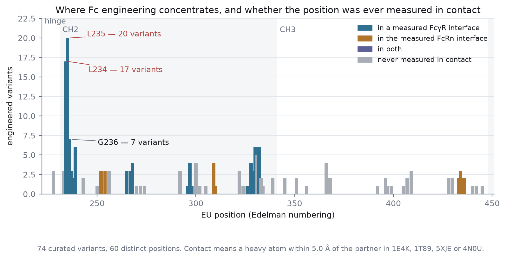
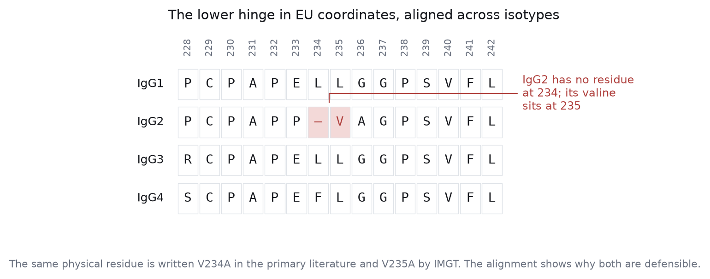
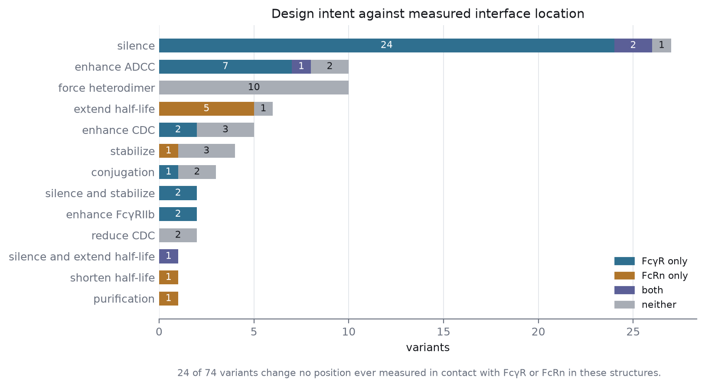
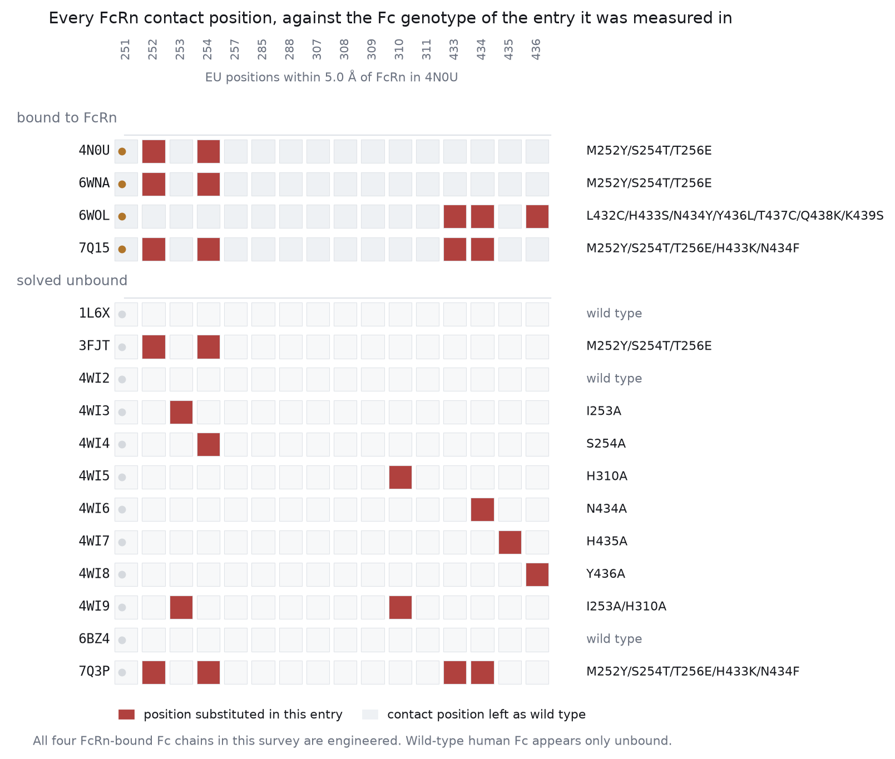
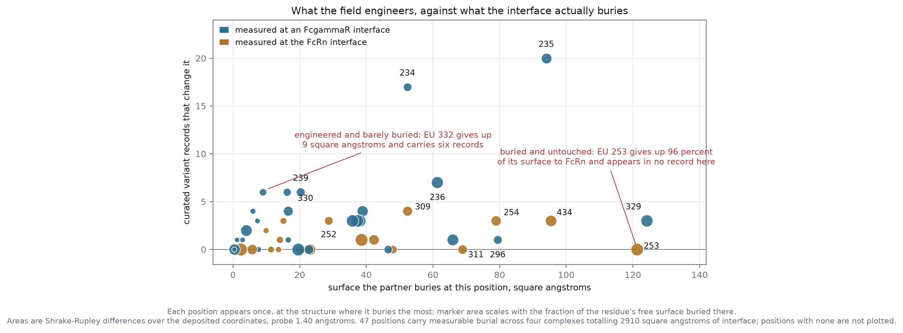

# Fc Variant Atlas

Aligned, sequence-validated, structure-linked Fc variants for IgG-based therapeutics.

Seventy-four curated engineered Fc records — effector silencing, effector
enhancement, half-life extension, heterodimerization, hexamerization,
stabilization, site-specific conjugation and purification handles — each one
checked residue by residue against the real UniProt constant-region sequence of
its isotype, placed on a cross-isotype EU alignment, and tested against
heavy-atom contacts measured in deposited Fc–receptor complexes.

Then it hands you a PyMOL script, a PyMOL plugin, and a browser viewer.

**Live viewer, nothing to install: https://datarichinsightpoor.github.io/fc-variant-atlas/**

```bash
pip install -e .
fcatlas show LALA-PG
fcatlas interface GASDALIE
fcatlas burial --pdb 4N0U --top 10
fcatlas pymol LALA-PG --pdb 1E4K -o lala-pg.pml && pymol lala-pg.pml
```

Nothing here is a lookup table of names someone typed once. Every substitution
in `data/variants.yaml` is asserted against a sequence at load time, and the
build fails when an assertion fails. That discipline caught two errors in this
repository's own curation before release and reproduced one genuine
disagreement in the published literature, described below.

## What the atlas contains

Seventy-four records spanning IgG1, IgG2, IgG3 and IgG4, touching sixty
distinct EU positions with 174 individual substitutions plus two deletions.
Design intents, as curated: effector silencing (27), ADCC enhancement (10),
heterodimerization (10), half-life extension (6), CDC enhancement (5),
stabilization (4), conjugation (3), silencing combined with stabilization (2),
FcγRIIb enhancement (2), CDC reduction (2), silencing combined with half-life
extension (1), half-life shortening (1) and purification (1).

Each record carries its aliases as they appear in the literature, its IMGT
engineered-variant code where one exists, a phenotype description tied to a
measurement rather than to an intent, an evidence class, named therapeutics or
clinical-stage molecules that use it, and a DOI.



Engineering is not spread evenly. Two adjacent leucines in the lower hinge, EU
234 and EU 235, account for a fifth of every substitution in the atlas. Beyond
them the field thins out quickly: most positions carry one or two variants, and
several heavily used ones sit nowhere near a measured contact.

## The part that is actually load-bearing

Fc engineering is written in three numbering systems that disagree, and the
disagreement is not cosmetic. EU (Edelman) numbering is what the primary
literature uses. IMGT unique numbering is what structural and immunogenetics
databases use. Sequential numbering is what your plasmid map uses. A position
called 234 in a paper is not necessarily residue 234 in the protein you are
about to express.

The atlas resolves this by aligning all four IgG constant regions to the IgG1
reference with an affine-gap global alignment and carrying the EU index as a
property of the alignment rather than as an offset. Once you do that, one
specific collision becomes visible.



IgG2 has no residue at EU 234. Its lower hinge is one residue shorter than
IgG1's, and the valine that IgG2-silencing papers call V234A sits at EU 235 in
a strict alignment. IMGT numbers the same physical residue V235A. Both are
defensible; they are answering different questions. The atlas stores that
record as disputed, reports both codes, and refuses to silently pick one.

The same validator caught two hand-typing errors in this repository before
release. EU 429 is histidine, not proline. EU 407 is tyrosine, not threonine.
Both were wrong in an early draft of the curation and both were caught by
asserting against sequence rather than by rereading. Reference residues in this
package are derived from the numbering module, never typed.

## Structure, and what the structures do not contain

Four deposited complexes are shipped with measured contacts rather than with
assertions: 1E4K and 1T89 (Fc with FcγRIIIb), 5XJE (Fc with FcγRIIIa, both
partners glycosylated) and 4N0U (Fc with FcRn, with albumin elsewhere in the
asymmetric unit). Contacts are computed as any Fc heavy atom within 5.0 Å of any
partner heavy atom, with a spatial grid, and the results are carried in
`data/structures.json` so nothing has to be recomputed at query time.

Both genotypes are recorded, not just the Fc one. 5XJE is the only FcγRIIIa
complex here and its receptor carries N56Q, N92Q, N187Q and F176V, so this set
contains no wild-type FcγRIIIa measurement. The albumin in 4N0U comes no closer
than 24.16 Å to the Fc and is excluded from every calculation rather than folded
into the partner.

Classifying every variant against those contacts produces a result worth
sitting with.



Twenty-four of seventy-four variants change no position that has ever been
observed in contact with FcγR or FcRn in these structures. Some of those are
genuinely allosteric or conformational by design: the knob-into-hole and
charge-pair heterodimerization sets act in the CH3 dimer interface, not at a
receptor. Others are hinge or CH2 substitutions whose mechanism is inferred
from function alone. The classification does not tell you a variant does not
work. It tells you where its explanation currently comes from.

A second provenance question turned out to matter more.



Of the FcRn-containing entries surveyed here, four contain an IgG Fc chain, and
all four of those Fc chains are engineered inside the FcRn contact patch: 4N0U
and 6WNA carry YTE, 7Q15 carries YTE with H433K/N434F, and 6WOL is a heavily
engineered monomeric IgG4 Fc. The remaining FcRn entries are albumin or viral
capsid complexes with no Fc at all. Wild-type human Fc appears in this survey
only unbound — 4WI2, 6BZ4 and the protein A complex 1L6X.

So the structural picture of how a wild-type IgG1 contacts FcRn is assembled
from engineered Fc plus unbound wild-type Fc, and the engineering sits inside
the region being described. Every PyMOL script the package generates prints the
Fc genotype of the entry it just fetched, and prints a caveat when that genotype
is not wild type. That is not pedantry. If you color EU 252 on 4N0U you are
coloring a tyrosine that the deposited construct put there.

## Buried surface, not just contact

Contact is a yes or no at a cutoff, and it is the weaker of the two things the
coordinates will tell you. `tools/measure_interfaces.py` computes, for every
position of every complex, the solvent-accessible surface each residue gives up
when the partner binds — Shrake-Rupley, probe 1.40 Å, heavy atoms only — along
with the partner residues it touches and a per-chain breakdown.



The two axes are close to unrelated, and the outliers are the point. EU 329
buries 120.5 Ų in 1E4K, 87 percent of its free surface, and carries three
records. EU 234, seventeen records and the second most engineered position in the
atlas, buries 52.3 Ų there and only 34 percent — it sits closer to FcγRIIIb than
EU 329 does while giving up far less surface, which is a reminder that proximity
and burial are different measurements. EU 332 buries 8.9 Ų at its best and
carries six records. EU 331 carries five and has neither burial nor contact in any
of these four structures, which is what a complement-directed position looks like
in a set containing no C1q. And EU 253 gives up 121.2 Ų, 96 percent of itself, to
FcRn in 4N0U while appearing in no curated record here at all.

The figure plots each position once, at the structure where it buries the most,
so a point is the best case for that position rather than an average over
non-comparable models.

Binding to the Fc dimer is asymmetric, so the areas are reported per chain as
well as per position. EU 234 buries 52.3 Ų on one heavy chain of 1E4K and 1.6 Ų
on the other; EU 329 does the reverse, 120.5 Ų against 5.2 Ų. A single number
per position would have hidden that.

```bash
fcatlas burial --pdb 1E4K --top 12          # most-buried positions
fcatlas burial --against-density            # attention against area
fcatlas partners LALA-PG --pdb 1E4K         # what each position touches
fcatlas provenance                          # genotypes, methods, resolutions
```

Method, conventions and scope are in `docs/interface.md`. Areas come from four
X-ray models at 2.4 to 3.8 Å; an area of zero means "not buried in these four
models," never "not buried."

## Plug and play

Generate a script for one variant on one structure:

```bash
fcatlas pymol GASDALIE --pdb 5XJE -o gasdalie.pml
pymol gasdalie.pml
```

The script fetches the entry over the network, shows Fc and partner as cartoon,
paints the measured interface, draws the variant positions as sticks with
labels, sets up a named view, and defines selections you can keep working with.
It ends with a comment block naming the Fc genotype in that entry and, when the
variant's positions do not contact the partner in that structure, saying so
outright rather than letting an empty selection imply an answer.

Pre-generated scripts for all seventy-four variants ship in `examples/pymol`
(against 1E4K) and `examples/pymol_fcrn` (against 4N0U), so the repository is
usable without running anything:

```bash
pymol examples/pymol/LALA-PG_1E4K.pml
```

Regenerate the whole set with `fcatlas pymol-all examples/pymol --pdb 1E4K`.

### A PyMOL plugin

The scripts are text and stay text. If you would rather have the atlas inside a
running PyMOL, `pymol_plugin/` builds an installable plugin:

```bash
python pymol_plugin/build_plugin_zip.py -o dist/
# PyMOL: Plugin > Plugin Manager > Install New Plugin > Choose file
```

It adds `fcatlas`, `fcatlas_list`, `fcatlas_show`, `fcatlas_interface`,
`fcatlas_partners`, `fcatlas_burial`, `fcatlas_compare`, `fcatlas_provenance` and
`fcatlas_hotspots` to the PyMOL command line, plus a small dialog when Qt is
available. `fcatlas_burial 4N0U` writes measured buried area into the B-factor
column and colors by it, so the spectrum on your screen is a measurement and not
a mood. `fcatlas_compare LALA-PG,LALA-PG-DAPA` loads one structure per variant
and lines the scenes up.

The plugin bundles its own copy of `data/`, so it works with no `pip install`,
and it resolves data in a fixed order: `FCATLAS_DATA` if you set it, then an
installed `fcatlas` package, then the bundled copy. Every scene prints the
genotype and provenance of the entry before it draws anything.

### A browser viewer

Running at https://datarichinsightpoor.github.io/fc-variant-atlas/, published
from the `gh-pages` branch, which holds the contents of `viewer/` at its root.
Or open `viewer/index.html` locally, or serve the directory. It
reads `viewer/atlas.json` and `viewer/interface_detail.json` and renders the same
content with 3Dmol.js — searchable variant list, intent and isotype filters,
structure switching, interface and glycan display, measured contact distances,
buried area per position with the per-chain asymmetry called out, the partner
residues each position touches, both genotypes with resolution and method, and
the isotype alignment block. The burial toggle colors residues on a fixed 0 to
125 Ų scale so color means the same thing when you change structures.

Deposited glycans are drawn as spheres rather than sticks, deliberately:
branched-sugar bond inference is unreliable and sticks produce artifacts that
look like structure.

The hosted copy is regenerated from `viewer/` rather than maintained separately.
The `gh-pages` branch holds the three files from `viewer/` at its root, so
publishing a change is a copy and a commit:

```bash
python -m fcatlas export json -o viewer/atlas.json
cp data/interface_detail.json viewer/
git worktree add /tmp/ghp gh-pages
cp viewer/index.html viewer/atlas.json viewer/interface_detail.json /tmp/ghp/
git -C /tmp/ghp commit -am "publish viewer from main" && git -C /tmp/ghp push origin gh-pages
git worktree remove /tmp/ghp
```

## Command line

```
fcatlas list [--intent silence] [--isotype IgG1]   curated variants
fcatlas show LALA-PG                               one record in full
fcatlas align [--from 228] [--to 340] [--fasta]    aligned isotype block
fcatlas hotspots                                   positions by variant density
fcatlas interface GASDALIE                         variant against measured contacts
fcatlas burial [--pdb ID] [--top N]                positions by buried surface
fcatlas burial --against-density                   records against buried area
fcatlas partners LALA-PG [--pdb 1E4K]              partner residues per position
fcatlas provenance                                 genotypes, methods, resolutions
fcatlas pymol LALA-PG [--pdb 1E4K] [-o f.pml]      one PyMOL script
fcatlas pymol-all DIR [--pdb 1E4K]                 a script per variant
fcatlas export {csv,json,fasta} [-o f]             machine-readable atlas
fcatlas validate                                   every record against sequence
fcatlas structures                                 structures and Fc genotypes
```

The alignment block prints a variant-density track under the residues, so you
can see engineering pressure and sequence divergence in the same view:

```
EU 228-287
  IgG1  PCPAPELLGGPSVFLFPPKPKDTLMISRTPEVTCVVVDVSHEDPEVKFNWYVDGVEVHNA
  IgG2  .....P-VA.....................................Q.............
  IgG3  R.............................................Q.K...........
  IgG4  S.....F.................................Q.....Q.............
        3    3++7326   2      1 3 3 3        3 34 1 1 1
```

## Python

```python
from fcatlas import load_variants, numbering, load_complexes, classify

v = {x.id: x for x in load_variants()}["LALA-PG"]
v.mutation_string()          # 'L234A/L235A/P329G'
v.validated_positions        # positions confirmed against sequence
v.mutated_sequence()         # the actual engineered constant region

n = numbering("IgG2")
n.residue(234)               # None - IgG2 has no residue there
n.residue(235)               # 'V'

cx = load_complexes()["1E4K"]
cx.at_interface(235), cx.distance(235)
cx.partner_genotype          # 'wild type'
cx.has_wild_type_partner     # True

classify()                   # every variant against every measured interface
```

```python
from fcatlas import load_interface, engineering_against_burial

d = load_interface()["1E4K"]
d.total_buried_area                # 722.8
d.ranked()[0].summary()            # most-buried position, one line
d.positions[329].is_asymmetric     # True
d.positions[329].protein_partners  # TRP87 chain C at 3.26 A
d.variant_buried_area("LALA-PG")   # 261.4

engineering_against_burial()       # records against area, one row per position
```

## Data files

| file | contents |
| --- | --- |
| `data/variants.yaml` | the curated source of truth, one record per variant |
| `data/structures.json` | measured contacts and the FcRn provenance survey |
| `data/interface_detail.json` | buried surface per position, partner residues, per-chain areas |
| `data/atlas.json` | full machine-readable export, schema `fcatlas/1` |
| `data/variants.csv` | flat table for spreadsheets and joins |
| `data/alignment.fasta` | the four EU-numbered constant regions, gapped |
| `data/alignment_block_228_340.txt` | rendered alignment with density track |
| `data/hotspots.txt` | positions ranked by variant density |

`data/*.fasta` are the UniProt constant-region sequences (P01857, P01859,
P01860, P01861), trimmed at the secreted terminus.

## Reproducing everything

```bash
pip install -e .
python -m pytest tests/ -q
python tools/enrich_structures.py            # genotypes and provenance from RCSB
python tools/measure_interfaces.py           # buried surface from coordinates
python figures/make_figures.py
python -m fcatlas export json -o data/atlas.json
python -m fcatlas pymol-all examples/pymol --pdb 1E4K
python pymol_plugin/build_plugin_zip.py -o dist/
```

The two `tools/` scripts download mmCIF files from RCSB into `tools/.cache/` on
first run and are the only thing here that needs the network. Rerunning them on
unchanged depositions reproduces `data/interface_detail.json` byte for byte.

A hundred and thirty-two tests cover the numbering, the variant records, the
structural layer, the buried-surface layer, the command line as text a person
reads, the PyMOL plugin against a recording fake of the `cmd` API, the citation
format and the exports. Every DOI in `data/variants.yaml` and
`data/structures.json` was resolved against Crossref during curation and checked
against the paper the record claims; four citations were wrong on the first pass
and were corrected before release.

Figures are byte-reproducible: no timestamps, no version strings, fixed element
order, PNG metadata chunks stripped. A diff in a figure means a
change in the data.

## Related open-license tools

See `docs/tools.md` for the survey. Short version: this repository leans on
3Dmol.js (BSD-3) for the browser viewer and generates PyMOL scripts as text, so
it has no runtime dependency on any viewer. Mol\* (MIT) and NGL (MIT) are drop-in
alternatives for the web layer, ANARCI (BSD-3) and AbNumber (MIT) handle variable
domains where this package deliberately does not, and Thera-SAbDab is the
reference source for therapeutic-antibody metadata. IMGT is cited, not vendored:
its data is academic-use restricted.

## Scope and honest limits

This is the constant region only. Variable-domain numbering is a solved problem
with better tools, and `docs/tools.md` points at them.

Curation is deep rather than exhaustive. Seventy-four records with provenance
are more useful than four hundred without, and the schema is built so that
adding a record forces you to supply a sequence-checkable substitution list and
a source. Records that fail validation do not enter.

Contacts and areas come from four structures. A position absent from all four is
not necessarily far from a receptor; it is unmeasured in this set. The
classification says "never measured in contact," never "not in contact."

Neither is a complete accounting of the interface. There is no C1q complex here,
no FcγRI, no FcγRIIa or IIb, no afucosylated Fc, and one receptor allotype per
entry. Areas are single-model measurements from static coordinates at 2.4 to
3.8 Å, with no error bar and no conformational ensemble behind them.

Phenotype fields describe what was measured in the cited work, in the assay of
that work. They are not a promise about your assay, your effector cells, or your
antigen density.

## Contributing

A new record needs an isotype, a substitution list in EU numbering, a phenotype
tied to a measurement, an evidence class and a DOI. Run `fcatlas validate` and
`pytest` before opening a pull request. If a substitution fails validation,
that is information — the record may be in IMGT numbering, or the reference
residue may be an allotype.

## License

MIT. See `LICENSE`. Structural data belongs to the PDB depositors and the
sequences to UniProt; both are cited per record.

## Documentation

- `docs/numbering.md` — EU, IMGT and sequential numbering, and the 234/235 collision
- `docs/structures.md` — what each structure is, how contacts are computed, and the provenance caveat
- `docs/interface.md` — buried surface: method, the two distance conventions, and what the areas say
- `docs/tools.md` — open-license tools this work builds on or can be swapped for
